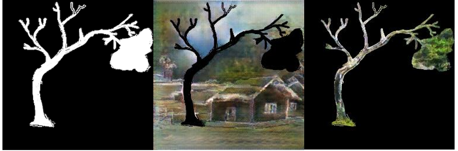

What if we could generate scene images that feel like a scene from a dream? We were interested in the space of image generation that would create results, unlike real-world images. Initially, we were inspired by a dataset of drawings from research that utilized images of scene categories to measure the recall capability of participants based on their drawings. To evaluate the recall drawing of the image scenes (Bainbridge2019) used Amazon Mechanical Turk (AMT) by recruiting thousands of blind scorers to assess the "drawings diagnosticity, number of objects, extraneous objects, spatial detail, and object size within the drawings." (Bainbridge2019)The drawings from memory represented an accurate spatial map of the entire image, and we wondered if we could train a model based scene images to create spatially viable images generated from simple drawings that we would consider as new and interesting scenes. This made us think about human recall ability vs. machine recall ability and we wondered what we could generate from the recall drawings dataset if we managed to create a machine model for those drawings and their scene images. This study generated a dataset of 2682 scene drawings, approx. 30 drawings per image scene. We found access to the dataset and also were refered to the orginal image scenes of the recall drawings. We hand matched drawings to their scene images, to create a "ground truth" per each drawing. Unfortunately, the original images of the drawings from the recall study were not formatted as squares so we had to reformat all, see below:

We used the code presented in https://phillipi.github.io/pix2pix/ to train a model based on the dataset we created from the recall drawinsg. After training the model, the results were interesting to a degree but not promising. The data set we had was not large enough to generate viable results.

The model we used seems to work well when there are clear edges matching to the ground truth images, and with at least 400 images (drawings per one ground truth image). We realized our training dataset was too small and since the model works best with clear edges we decided to try something else. We found another dataset of scenes that had 24,335 images (https://kaggle.com/nitishabharathi/scene-classification). Since we did not have hand drawings of these images we found an alternative. We used the canny edge detection to get the line edges of the images and use it as "drawings" training data matching to the ground truth image scenes and then trained over 100 hours, up to epoch 150. 

We were curious about what results we will get as our dataset was highly variable. We tested by using a recall drawing matched to their ground truth scene image from our initial training dataset. We realized that the image was lacking depth, so we ran a comparison with the image edges as an input and the results were more realistic.

The results had a lot of noise and were far from realistic, however, we could see potential in some of the images generated. Some looked as if could have been made by impressionist painters. 

We thought it could be interesting to generate a few of these "new scenes" as a base for a larger artwork piece that would combine the resulting scenes from the drawings. We created a joint artwork between multiple people's recall drawings of a house image scene, the machine model and us, interpreting and reworking the results.  

We also tried another for combining the generated image scenes. Instead of combining the results from the recall drawings of the same image scene (e.g. an image of a house), we combined (collaged) results from various image scene recall drawings. The recall drawings, in this case, were of different categories of scene images such as a playground, sky-rise building, farm, mountain landscape etc. We appreciated the result of this step. 

From the image above, the colors in the result are blended, and the objects cannot be distinguished in the output. At this time, we are not completely pleased with our results since there is more noise than we aimed for. Similar with the project of from NVIDIA (https://blogs.nvidia.com/blog/2019/03/18/gaugan-photorealistic-landscapes-nvidia-research/?ncid=so-you-n1-78256), they turns doodles into stunning, photorealistic landscapes.  create new scenes, we would like to take a different approach and train on specific item category separately. We want to work towards creating a new scene by generating a few separated items from drawings, and then collage to create a new artwork. The idea is similar to what we presented above, only the training method is different. In order to get more realistic results from our training, we need to find the appropriate specific categories to train on, "part of scenes," such as trees, rivers, types of building, etc. Then the person who creates the drawing would be directed to draw from memory per each of the categories or would be able to choose a few categories out of many. The model would generate separate images and will then collage these together by adding masks for each of them to create the new scene artwork.  

We began testing this concept by using specific categories for training data, like categories of flowers (sunflower, daisy, dandelion, rose) from https://kaggle.com/alxmamaev/flowers-recognition datasets. Other categories we have trained on include fruit, trees, and river, etc. We are using this as a test on a relatively small number of images (up to 1000 images per category) to check results before moving forward on this concept. Testing results based on edges as input yield pretty good results. our testing resluts from line edges look like this: 

Use the different models, we would like to combine them into one scene. First example we have tried is showed in next figure. We found a drawing online, which contains houses, trees, and river. After we get the edges of the image and get the result from different networks we trained based on tree dataset and river (see image below).

In order to combine two images, we created the masks for different objects, see image below.

And we multiply the mask with the results from the train networks, and finally we add the two images to get the result in image below, where the edges of the tree are preserved and filled in more green color. 

Second example we want to combine different component into one image, shown in image below left column. We got images for tree and ocean and we get result from different network for trees and ocean, and we got the result as in image below right column.

For combining the ocean and tree outputs, the mask we generate are shown in image below top too images, and by doing some multiplication and addition operations to the mask and the outputs, the final result is shown in image below right bottom image. 

